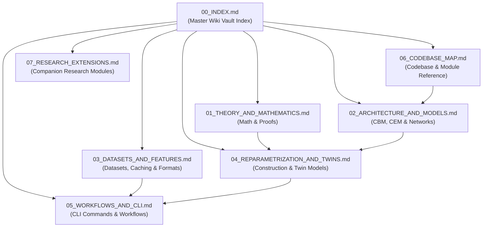

# LLM Wiki Vault: Readout-Invisible Reparameterization & Concept Models

Welcome to the **LLM Wiki Vault** for the **`Credal_Sets` / Readout-Invisible Reparameterization** codebase. This vault is structured as a cross-linked knowledge graph optimized for human researchers and LLM context navigation.

---

## 🗺️ Master Table of Contents & Knowledge Graph

---

## 📌 Quick Navigation Index

| Vault Document | Topic | Key Concepts |
| :--- | :--- | :--- |
| [01_THEORY_AND_MATHEMATICS.md](file:///Users/cril/tanmoy/research/Credal_Sets/wiki/01_THEORY_AND_MATHEMATICS.md) | **Mathematical Foundations** | Null space, Readout $R$, Invariant map $z \to B z + t$, SVD decomposition, Interventions |
| [02_ARCHITECTURE_AND_MODELS.md](file:///Users/cril/tanmoy/research/Credal_Sets/wiki/02_ARCHITECTURE_AND_MODELS.md) | **Model Architecture** | `ConceptModel`, `CBM`, `CEM`, concept layer $z$, residual dim $r$, concept embeddings $c_i^\pm$ |
| [03_DATASETS_AND_FEATURES.md](file:///Users/cril/tanmoy/research/Credal_Sets/wiki/03_DATASETS_AND_FEATURES.md) | **Datasets & Features** | CEBaB, GoEmotions, Civil Comments, IMDB-CAD, MPNet encoder, feature cache |
| [04_REPARAMETRIZATION_AND_TWINS.md](file:///Users/cril/tanmoy/research/Credal_Sets/wiki/04_REPARAMETRIZATION_AND_TWINS.md) | **Twin Construction** | `invisible_map`, SVD, matrix exponential rotation $G$, mixing $M$, shift $t$, weight folding |
| [05_WORKFLOWS_AND_CLI.md](file:///Users/cril/tanmoy/research/Credal_Sets/wiki/05_WORKFLOWS_AND_CLI.md) | **Workflows & Scripts** | `download.py`, `train.py`, `twin.py`, `explain.py`, reference benchmarks |
| [06_CODEBASE_MAP.md](file:///Users/cril/tanmoy/research/Credal_Sets/wiki/06_CODEBASE_MAP.md) | **Codebase API Reference** | Module tree, file responsibilities, class & function signatures |
| [07_RESEARCH_EXTENSIONS.md](file:///Users/cril/tanmoy/research/Credal_Sets/wiki/07_RESEARCH_EXTENSIONS.md) | **Companion Research** | `Optimization/`, `Random_Sets/`, `Patch_Uncertainty/`, `Multi_Sets/` |

---

## 💡 Executive Overview of the Project

A **Concept Model** (e.g., Concept Bottleneck Model or Concept Embedding Model) introduces a intermediate concept layer $z$ between a feature encoder trunk $h(x)$ and a downstream prediction head $y(z)$:

$$x \xrightarrow{\text{trunk}} h \xrightarrow{\text{concept layer}} z \xrightarrow{\text{head}} \text{task logits}$$
$$\downarrow \text{readout } R$$
$$\text{concept logits} \xrightarrow{\text{sigmoid}} \text{concept probabilities}$$

### The Key Insight
The concept layer $z$ is compared to human ground-truth concept annotations **only through a readout operator $R$**. 
Any variation of $z$ inside the **null space of $R$** is completely unseen by the concept loss function.

This codebase demonstrates how to construct a **Twin Model**:
- We transform $z \to z' = B z + t$ along directions ignored by $R$ ($R B = R$ and $R t = 0$).
- We fold $B$ into the encoder/generator layer producing $z$ and compensate with $B^{-1}$ in the downstream head.
- Result: **The task logits and concept probabilities remain identical** (up to floating-point precision), while internal concept representations change dramatically!

---

## 🔍 Core Terminology Dictionary

- **Concept Layer ($z$)**: The hidden bottleneck or embedding vector extracted before predicting task logits.
- **Readout ($R$)**: Linear operator mapping $z$ to concept logits.
- **Invisible Dimensions**: Directions in $z$ that lie in $\ker(R)$ (null space of $R$).
- **Twin Model**: A model obtained by affine reparameterization $z \to B z + t$ whose predictions and concept probabilities match the original model exactly.
- **Concept Bottleneck Model (CBM)**: Model where concepts are scalar values (logits/probs), optionally with a residual vector $r$.
- **Concept Embedding Model (CEM)**: Model where each concept $i$ is represented by a pair of vectors $c_i^+, c_i^- \in \mathbb{R}^m$.
