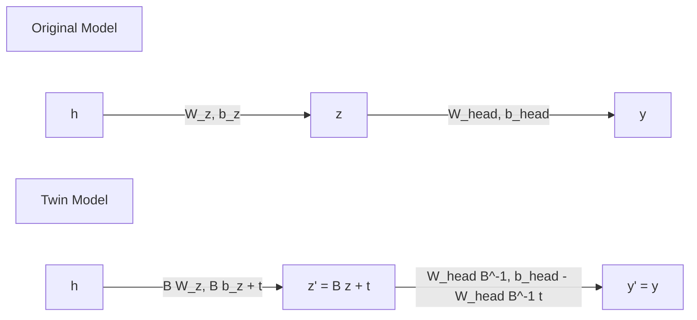

# 01. Mathematical Foundations & Readout-Invisible Reparameterization

This document details the mathematical framework behind concept models, readout matrices, null space decomposition, and readout-invisible affine transformations.

---

## 1. Concept Models & Architecture Overview

A Concept Model processes input feature $x \in \mathbb{R}^d$ through a trunk to produce an internal representation $h$, followed by a concept layer $z \in \mathbb{R}^D$:

$$z = \text{ConceptLayer}(h(x))$$

The model computes two outputs:
1. **Concept Logits** $\hat{c} = R z$, where $R \in \mathbb{R}^{p \times D}$ is the linear readout matrix. The estimated concept probabilities are $\hat{p} = \sigma(R z)$.
2. **Task Logits** $\hat{y} = \text{Head}(z)$, where $\text{Head}: \mathbb{R}^D \to \mathbb{R}^C$ maps the concept layer to target task logits.

---

## 2. Null Space Decomposition of Readout $R$

Let $R \in \mathbb{R}^{r_{\text{rank}} \times d}$ be a readout block for $z \in \mathbb{R}^d$.
Using Singular Value Decomposition (SVD):

$$R = U_S \Sigma V^T$$

where:
- Singular values $\sigma_1 \ge \dots \ge \sigma_r > 0$.
- The right singular vectors $V \in \mathbb{R}^{d \times d}$ are partitioned into:
  - $U \in \mathbb{R}^{d \times r}$: Orthonormal basis for $\text{rowspan}(R)$ (visible directions).
  - $N \in \mathbb{R}^{d \times n}$: Orthonormal basis for $\ker(R)$ (invisible null-space directions, $n = d - r$).

Any concept vector $z \in \mathbb{R}^d$ can be uniquely expressed in coordinates $(a, b) \in \mathbb{R}^r \times \mathbb{R}^n$:

$$z = U a + N b \quad \text{where } a = U^T z, \; b = N^T z$$

---

## 3. The Readout-Invisible Affine Transformation

We define an affine transformation $z' = B z + t$ such that $R z' = R z$ for all $z$.

### Mathematical Constraints
To guarantee $R(B z + t) = R z$:
1. $R B = R$ (Matrix multiplicative condition)
2. $R t = 0 \implies t \in \ker(R)$ (Additive condition)

### Parametrization in Subspace Coordinates $(a, b)$
Expressed in the basis $Q = [U \;\; N] \in \mathbb{R}^{d \times d}$:

$$B = Q \begin{bmatrix} I_r & 0 \\ M & G \end{bmatrix} Q^T, \qquad t = N t_{\text{null}}$$

where:
- **$I_r \in \mathbb{R}^{r \times r}$**: Identity matrix acting on visible components $a$ (preserves $R z$).
- **$G \in \mathbb{R}^{n \times n}$**: Orthogonal rotation matrix acting on invisible components $b$.
  Calculated via matrix exponential of a skew-symmetric matrix $A = -A^T$:
  $$G = \exp\left( \frac{\text{rotate}}{\sqrt{2n}} (A - A^T) \right) \in SO(n)$$
- **$M \in \mathbb{R}^{n \times r}$**: Mixing matrix that feeds visible coordinates $a$ into invisible coordinates $b$:
  $$M = \frac{\text{mix}}{\sqrt{\max(r, 1)}} \cdot Z_M \quad (Z_M \sim \mathcal{N}(0, I))$$
- **$t_{\text{null}} \in \mathbb{R}^n$**: Shift vector in the null space:
  $$t_{\text{null}} = \frac{\text{shift}}{\sqrt{n}} \cdot Z_t \quad (Z_t \sim \mathcal{N}(0, I))$$

### Verification Proof of $R B = R$
Since $U$ spans the row space of $R$, $R N = 0$ and $R U U^T = R$:

$$R B = R [U \;\; N] \begin{bmatrix} I_r & 0 \\ M & G \end{bmatrix} [U \;\; N]^T$$
$$= [R U \;\; 0] \begin{bmatrix} I_r & 0 \\ M & G \end{bmatrix} [U \;\; N]^T$$
$$= [R U \;\; 0] [U \;\; N]^T = R U U^T = R \quad \blacksquare$$

Similarly, $R t = R N t_{\text{null}} = 0$.

---

## 4. Weight Folding Mechanics

The transformation $z \to B z + t$ is folded into model parameters without introducing runtime overhead.

### 1. Folding into the Concept Generator Layer
Let the concept layer be linear: $z = W_z h + b_z$.
Replacing $z$ with $z' = B z + t$:

$$z' = B(W_z h + b_z) + t = (B W_z) h + (B b_z + t)$$

Thus, the updated generator weights are:
$$\tilde{W}_z = B W_z, \qquad \tilde{b}_z = B b_z + t$$

### 2. Folding into the Downstream Task Head
Let the first layer of the head be linear: $\text{Head}_1(z) = W_h z + b_h$.
To maintain exact predictions $\text{Head}_1(z') \equiv \text{Head}_1(z)$:

$$\tilde{W}_h z' + \tilde{b}_h = W_h z + b_h$$
$$\tilde{W}_h (B z + t) + \tilde{b}_h = W_h z + b_h$$

Equating terms:
$$\tilde{W}_h B = W_h \implies \tilde{W}_h = W_h B^{-1}$$
$$\tilde{W}_h t + \tilde{b}_h = b_h \implies \tilde{b}_h = b_h - W_h B^{-1} t$$

---

## 5. Model-Specific Readout Structures

### Concept Bottleneck Model (CBM)
In CBM, $z = [c_1, \dots, c_k, r_1, \dots, r_r]^T$, where $c$ are concept logits and $r$ is a residual vector.
The readout matrix $R = [I_k \;\; 0_{k \times r}] \in \mathbb{R}^{k \times (k+r)}$.
- Visible dimension: $k$
- Invisible dimension: $r$

### Concept Embedding Model (CEM)
In CEM, each concept $i \in \{1,\dots,k\}$ has two embeddings $c_i^+, c_i^- \in \mathbb{R}^m$.
Concept probability is $p_i = \sigma(s^T [c_i^+ ; c_i^-])$, where $s = [s^+ ; s^-] \in \mathbb{R}^{2m}$.
The concept representation $z_i = p_i c_i^+ + (1 - p_i) c_i^- \in \mathbb{R}^m$.
For a map $B_i \in \mathbb{R}^{m \times m}$ applied to both $c_i^+$ and $c_i^-$, $p_i$ is invariant iff:

$$(s^+)^T B_i = (s^+)^T \quad \text{and} \quad (s^-)^T B_i = (s^-)^T$$

Thus $R_{\text{block}, i} = \begin{bmatrix} (s^+)^T \\ (s^-)^T \end{bmatrix} \in \mathbb{R}^{2 \times m}$.
- Visible dimension per concept: $r_i = \text{rank}(R_{\text{block}, i}) \le 2$
- Invisible dimension per concept: $m - r_i$ (typically $m - 2$)
- Total invisible dimensions for $k$ concepts: $k \cdot (m - 2)$
