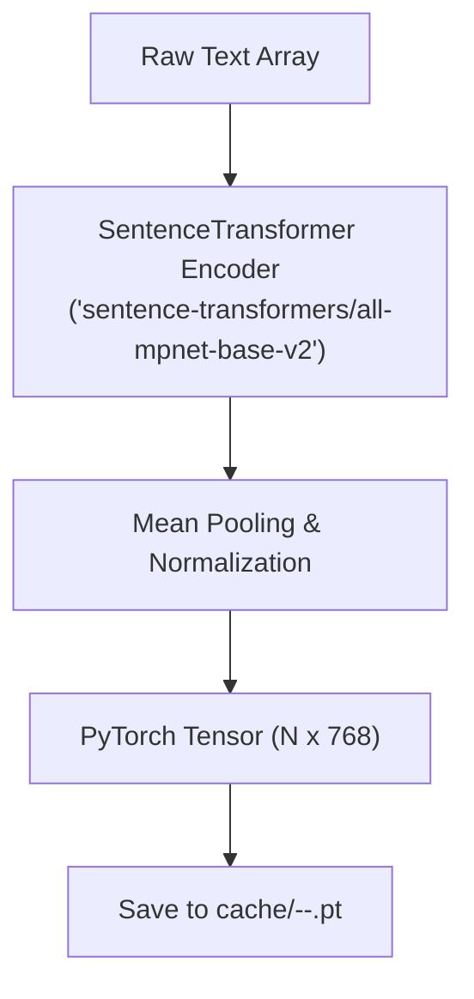

# 03. Datasets, Text Formatting & Feature Caching

This document covers data preparation, dataset schemas, standardized JSONL formats, and feature extraction in [`concept_datasets/`](file:///Users/cril/tanmoy/research/Credal_Sets/concept_datasets) and [`concept_models/features.py`](file:///Users/cril/tanmoy/research/Credal_Sets/concept_models/features.py).

---

## 1. Supported Text Datasets

The benchmark supports four text classification datasets with binary concept annotations:

| Dataset Name | Source | Task (# Classes) | # Concepts | Split Sizes (Train / Val / Test) |
| :--- | :--- | :--- | :--- | :--- |
| **`cebab`** | HuggingFace `CEBaB/CEBaB` | Restaurant Star Rating (5) | 8 (food, service, ambiance, noise $\times$ pos/neg) | 9,848 / 1,673 / 1,689 |
| **`goemotions`** | HuggingFace `go_emotions` | Sentiment Group (4: pos, neg, amb, neu) | 28 emotions | 42,588 / 5,303 / 5,349 |
| **`civil_comments`** | HuggingFace `google/civil_comments` | Toxicity $\ge 0.5$ (2) | 6 toxicity sub-types (score $\ge 0.2$) | 40,000 / 5,000 / 10,000 (balanced) |
| **`imdb_cad`** | IMDB-C + CAD (Kaushik et al.) | Sentiment (2) | 16 (8 movie aspects $\times$ pos/neg) | 2,000 / 500 / 500 (+ 4,880 counterfactual pairs) |

---

## 2. Standardized On-Disk Format (`_common.py`)

All downloaded datasets are stored in `data/<dataset_name>/` as:
- `train.jsonl`
- `val.jsonl`
- `test.jsonl`
- `meta.json`

### Sample JSONL Example Record
```json
{
  "text": "The food was fantastic, but the noise level was unbearable.",
  "label": 2,
  "concepts": [1, 0, 0, 0, 0, 0, 0, 1],
  "info": {
    "original_id": "rev_1042",
    "edit_goal": "noise_neg",
    "edit_type": "negative"
  }
}
```

### Dataset Metadata Schema (`meta.json`)
```json
{
  "dataset": "cebab",
  "class_names": ["1-star", "2-star", "3-star", "4-star", "5-star"],
  "concept_names": ["food_pos", "food_neg", "service_pos", "service_neg", ...],
  "concept_groups": null,
  "sizes": {"train": 9848, "val": 1673, "test": 1689}
}
```

---

## 3. Feature Extraction & Disk Caching (`concept_models/features.py`)

To ensure fast training iteration, texts are passed through a frozen sentence transformer encoder, and the resulting dense embeddings are cached on disk.



### API Interface
```python
from concept_models.features import get_features

# Computes features on first call, then loads instantly from cache/
features = get_features(dataset="cebab", split="train", encoder_name="sentence-transformers/all-mpnet-base-v2")
X = features["X"]        # torch.FloatTensor of shape (N, 768)
y = features["y"]        # torch.LongTensor of shape (N,)
C = features["concepts"] # torch.FloatTensor of shape (N, k)
```

---

## 4. Special Handling & Nuances

- **CEBaB**: Contains counterfactual edit metadata (`edit_goal`, `edit_type`) in `info` for causal explanation benchmarks.
- **GoEmotions**: Multilabel emotion annotations grouped into 4 sentiment categories. Comments containing both positive and negative emotions are excluded from task labels.
- **Civil Comments**: Sub-types use a 0.2 soft concept threshold because `severe_toxicity` is extremely rare at 0.5. Soft concepts can be passed via `--soft_concepts`.
- **IMDB-CAD**: Includes an additional split `cad_pairs.jsonl` (4,880 paired original/counterfactual reviews) to test contrastive counterfactual predictions.
